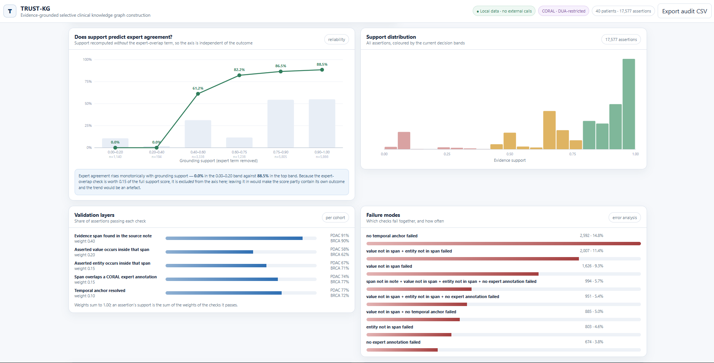
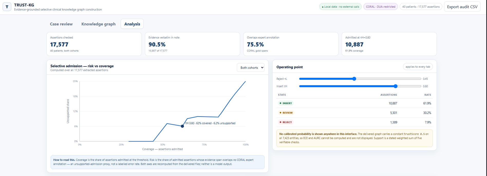
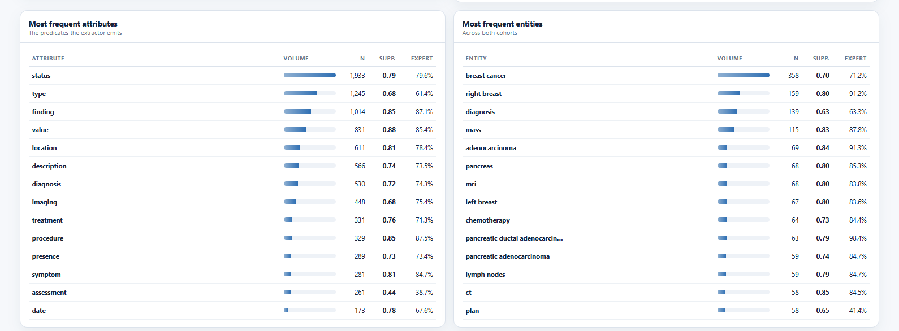

# TRUST-KG

**Evidence-Grounded, Calibrated, and Selective Knowledge Graph Construction from Heterogeneous Clinical Big Data**

TRUST-KG builds ontology-aligned clinical knowledge graphs from free-text medical narratives and validates
each candidate fact **before** it is written to the graph. Unlike RAG/GraphRAG systems that use retrieval only
for downstream answering, TRUST-KG applies retrieval + verification at *construction time*: an
Entity–Attribute–Value (EAV) triple is admitted only if it is source-grounded, ontology-compatible,
schema-valid, temporally consistent, and passes a trust threshold.

> Target venue: **IEEE BigData 2026**. No patient data is committed (see [Data & ethics](#data--ethics)).
>
> **Canonical paper numbers → [docs/PAPER_TABLES.md](docs/PAPER_TABLES.md)** — a table-by-table reference
> mirroring the draft's 6 tables, with every cell marked ✅ verified / ⛔ pending / ⚠️ needs decision, plus the
> abstract `[GATED]` fill-in map. Update the manuscript from that file.

---

## Contributions (IEEE BigData positioning)

TRUST-KG is a **data-veracity / ingestion-governance** contribution for building knowledge graphs from
heterogeneous data at scale — not merely a clinical extractor. Mapped to the big-data V's:

1. **Veracity — calibrated, selective admission control (the headline).** LLM extraction over massive
   heterogeneous text can't be human-verified at scale, so TRUST-KG casts KG *ingestion* as **calibrated
   selective prediction**: each candidate fact is scored for reliability and **inserted / routed-to-review /
   rejected before materialization**, at a **tunable quality–coverage operating point**. **Demonstrated on
   CORAL** (held-out test): a learned reliability model is **near-perfectly calibrated (ECE 0.009 vs 0.172
   heuristic)** and drives a **tunable** gate — auto-inserting ≈everything at a 95% precision bar, or selectively
   routing 44% to review to reach **98.4% precision at a 99% bar**. → Table II.
2. **Variety — heterogeneous, multi-source integration.** One pipeline unifies expert oncology reports
   (CORAL), ICU notes (MIMIC-III), and longitudinal EHR (MIMIC-IV) — multi-institution, **pan-cancer** — into
   a single ontology-aligned, FHIR-typed, SPARQL-queryable RDF graph. → Tables I, V.
3. **Volume — scale at ingestion + bounded-cost scalability.** The oncology cohort is filtered from
   **≈6.3 M diagnosis rows / 2 M+ notes / 546 K admissions** in BigQuery; Table VI characterizes
   **throughput, verification latency, and cost as corpus fraction grows**, via a resident-model,
   batched-inference extractor — a *scalable method*, not a huge graph. → Table VI.
4. **Value — unstructured → queryable analytics.** Narratives become **SPARQL-executable** cohort / temporal /
   multi-hop queries. → Table V.

**Why this reads as BigData, not clinical-NLP:** the admission-control mechanism is **domain-general** (it
governs any LLM-to-graph ingestion); the evaluation foregrounds the **quality–coverage trade-off and scaling
behavior**; and the volume claim rests on the **millions of records filtered at ingest**, not the final
graph size.

---

## Related work & positioning

Clinical KG construction from free text with LLMs is an active 2024–2026 direction, and *trust /
verification* is its frontier — but existing methods stop short of a **calibrated, tunable admission
decision per fact**. TRUST-KG sits at the intersection of three lines and fills the gap where they meet.

- **LLM-based (clinical) KG construction with a verification stage.** MedKGent (npj Digital Medicine
  2025; arXiv:2508.12393) scores triples by self-consistency frequency and filters at a fixed threshold;
  SAC-KG (ACL 2024; arXiv:2410.02811) adds a rule-based Verifier–Pruner that *corrects* errors; DIAL-KG
  (arXiv:2603.20059) filters facts at construction time via multi-stage "governance" adjudication. All
  verify — but with **single-threshold / rule-based / binary** decisions; none calibrate reliability or
  expose a quality–coverage operating point.
- **Selective prediction & calibration.** SelectLLM (NeurIPS 2025) and the risk–coverage literature
  (e.g., AUGRC, NeurIPS 2024) provide calibrated abstention and the correct evaluation apparatus (ECE,
  risk–coverage) — but for *question answering*, and as a two-way answer/abstain, not per-triple KG
  ingestion with a tiered policy.
- **FHIR / ontology-grounded clinical IE.** Infherno (EACL 2026; arXiv:2507.12261) converts notes to
  HL7 FHIR resources with terminology grounding and schema validation, treating correctness as a
  **binary** structurally-valid outcome rather than a graduated, calibrated one.

**The gap TRUST-KG fills.** None of these unifies **probability calibration + risk–coverage selective
prediction + a three-way Insert / Review / Reject admission policy applied per triple at construction
time**, nor frames KG construction as a **Big-Data data-veracity / ingestion-governance** problem. That
intersection — a calibrated, tunable gate deciding *what is trustworthy enough to persist* before
materialization — is TRUST-KG's position. It extends a preliminary CORAL-based clinical-KG study
(arXiv:2601.01844) by adding the calibration + selective-admission layer, a sub-5B open-weight ensemble,
MIMIC-scale evaluation, and hybrid BM25 + MedCPT + graph retrieval.

| Closest work | Shares with TRUST-KG | TRUST-KG adds |
|---|---|---|
| DIAL-KG | construction-time verify-before-store | calibration + risk–coverage + **tiered** admission (vs binary filter) |
| SelectLLM / AUGRC | calibrated selective prediction, risk–coverage | applied to **per-triple KG ingestion**; 3-way Insert/Review/Reject |
| MedKGent | per-triple confidence + filtering | calibration vs heuristic threshold; clinical notes + FHIR / 5-layer validation |
| SAC-KG | dedicated verification stage | reliability **scoring + admission** vs rule-based error correction |
| Infherno | note→FHIR, terminology grounding | graduated calibrated confidence + admission into a **queryable KG** |

**On comparability.** These works use different datasets and outputs (literature vs patient KGs; FHIR
resources vs RDF), so no shared external benchmark exists. TRUST-KG therefore compares **on its own gold
data**: prior-style single-threshold *heuristic trust* vs *learned + calibrated* selective admission on
held-out CORAL (Table II), against a Vanilla-RAG floor (Table III), plus the direct delta over the
preliminary version above. (Fuller internal positioning + must-cites: [docs/RELATED_WORK.md](docs/RELATED_WORK.md).)

---

## Pipeline

```
clinical note ─► NER (SciSpaCy) ─► schema-constrained EAV extraction (LLM, FHIR-typed)
                                        │
            hybrid retrieval  ◄─────────┤   BM25 (lexical) + MedCPT (dense) + graph-neighborhood
            (evidence grounding)        ▼
                     trust-aware validation ─► source-grounding · ontology · schema ·
                     (rule-based + learned)    temporal · contradiction · calibrated reliability
                                        │  (admit if trust ≥ δ and source-grounded)
                                        ▼
                     RDF materialization (FHIR types, ontology links, provenance)
                                        ▼
                     SPARQL cohort / temporal / multi-hop queries
```

Two recall levers used in the reported config: **two-pass extraction** (pass 2 re-extracts seeded with
pass-1 triples as graph-neighborhood evidence) and **ensemble union** across models — which raises recall
*and* precision (independent models reinforce true positives).

**No fine-tuning — the extractor is zero-shot.** Every model (Gemma-4-E4B, Llama-3.2-3B, Qwen3-4B,
MedGemma-4B) is used **off-the-shelf, with no weight updates**. All extraction behaviour comes from the
*structured FHIR-typed prompt + hybrid RAG grounding (BM25 + MedCPT + graph-neighborhood) + the two-pass
anchor* (inference-time self-refinement) — **no LoRA/QLoRA, no supervised fine-tuning, no labelled training
data**. The **only** trained component in the whole system is the veracity layer's reliability classifier —
a small scikit-learn GradientBoosting model fit on CORAL-gold trust features — which scores *admission*,
not extraction, and is not an LLM. This is deliberate: the pipeline transfers to a new corpus (MIMIC) with
**zero adaptation**, and quality is bought by *calibrated selective admission + normalization* rather than
by training the extractor. (Fine-tuning would enter only via the *distillation* future-work path, off this paper.)

### Knowledge-graph construction (schema + instances)

The KG is built as a shared **schema (TBox)** that the **instances (ABox)** conform to — not a bare
instance dump. Steps from extracted triples to queryable KG:

1. **Ensemble union** — pool the 4 models' triples per note; exact-dedup.
2. **Trust admission** — 5-layer validation → calibrated trust `T(τ)`; retain `T ≥ δ` (or route
   Insert / Review / Reject at the chosen operating point).
3. **Normalization** (`src/graph/triple_normalizer.py`) — canonicalize `fhir_type` → a real FHIR resource;
   drop PHI / vacuous / administrative triples; collapse degenerate (`entity==value`); **scrub
   de-identification placeholders from every text field** — entity/value labels *and* evidence/temporal
   spans — covering MIMIC-III `[** … **]`, MIMIC-IV `___`, and `Known lastname` / `hospitalN` remnants
   (including truncated `[**` / `**]` fragments), replaced with `REDACTED`; dedup by canonical key.
4. **Schema / TBox** (`src/graph/schema.py`) — a type-level ontology: FHIR-aligned `owl:Class` hierarchy
   (`fhir:Condition` / `Observation` / `Procedure` / … ⊑ `trustkg:ClinicalEntity`) + provenance/trust
   predicates (`hasEntity`, `hasValue`, `temporalAnchor`, `evidenceSpan`, `trustScore`, `consensusLevel`,
   `ontologyCode`) + an `OntologyConcept` class for SNOMED/RxNorm/LOINC grounding.
5. **Instances / ABox** (`src/graph/rdf_builder.py`) — each entity → a typed node (`rdf:type` its FHIR
   class), `rdfs:label`, `attribute → predicate → value`; ontology grounding via `owl:sameAs`
   SNOMED/RxNorm/LOINC; trust / evidence / temporal annotations.
6. **Materialize** — the TBox is merged into each cohort `.ttl` (self-contained schema+instances) and
   also written standalone as `schema.ttl`. Run via `scripts/run_coral_graph.py` / `run_mimic_graph.py`.
7. **Query** — SPARQL cohort / temporal / multi-hop queries validate the graph.

Result: a schema-conformant, FHIR-aligned, PHI-clean KG, loadable in any triple store / Protégé with the
TBox present for reasoning. **De-identification holds end-to-end:** the input notes are already
de-identified per PhysioNet, and normalization additionally scrubs every de-id placeholder from the graph
(step 3), so the materialized KG contains **zero de-id markers** — verified across all four cohorts.

---

## Datasets (all oncology)

| Dataset | Domain | Patients | Cases (notes) | Median len | Gold | Role |
|---|---|---:|---:|---:|---|---|
| CORAL-PDAC | Pancreatic oncology | 20 | 20 | ≈11 K | expert entity spans | entity P/R/F1 |
| CORAL-BRCA | Breast oncology | 20 | 20 | ≈11 K | expert entity spans | entity P/R/F1 |
| MIMIC-III (onc.) | ICU/EHR oncology | 392 | 400 | ≈10.4 K | — | scale / source-grounding |
| MIMIC-IV (onc.) | EHR oncology | 394 | 400 | ≈10.1 K | — | scale / source-grounding |

**CORAL** (40 patients = 20 pancreatic + 20 breast) is the annotated benchmark — dense oncology narratives
with expert `PROBLEM`/`TEST`/`TREATMENT` spans for entity-level evaluation.

**MIMIC-III / MIMIC-IV (oncology subsets)** — 400 notes each (≈392–394 distinct patients / 400 admissions),
filtered to **malignant-neoplasm ICD codes** (ICD-10 `C00–C97` / ICD-9 `140–208`). A **pan-cancer**
population (by note mentions: lung > colorectal > GI/esophageal > GU > head-&-neck > breast > prostate >
pancreatic), broadening CORAL's breast+pancreatic focus. No expert entity gold, so (per the paper's design)
they drive **scale + source-grounding** stats, not P/R/F1.

---

## Results — CORAL, full pipeline end-to-end (per cohort)

The complete pipeline runs end-to-end on all 40 CORAL patients; results are **per cohort** (20 PDAC +
20 BRCA), never pooled.

**Stage 1 — Extraction** · sub-5B ensemble (Gemma-4-E4B **2-pass anchor** ∪ single-pass Llama-3.2-3B,
Qwen3-4B, MedGemma-4B), entity-level vs gold (exact scorer):

| Cohort | N | Precision | Recall | F1 (mean ± sd) | 95% CI |
|---|---|---|---|---|---|
| CORAL-PDAC | 20 | 0.958 | 0.815 | **0.879 ± 0.048** | [0.858, 0.900] |
| CORAL-BRCA | 20 | 0.940 | 0.848 | **0.890 ± 0.044** | [0.871, 0.909] |

Both cohorts' F1 **match/beat the prior Gemma-3 + Qwen-8B ensemble** (0.877 / 0.868) at **precision ≈0.95** and
half the parameter budget — the all-≤5B constraint cost nothing. The 2-pass anchor lifts ensemble recall from
≈0.73 (1-pass) to **0.83**. → Table **III**.

**Stage 2 — Validation** · **construction gate** (admit if `trust ≥ δ=0.4` ∧ source-grounded): admits **98.99%**
of candidate triples across all 840 records — prunes only ungrounded/degenerate ones; every admitted triple is
materialized with its trust score + 5-layer provenance. (The 95/98/99% selective-admission operating points in
Table II are a separate, tunable *downstream* reliability policy, not a KG prune.)

**Stage 3–4 — RDF materialization (schema + instances) + SPARQL cohort queries** (all queries execute) → Table **V**:

| | CORAL-PDAC | CORAL-BRCA |
|---|---:|---:|
| admitted / candidate triples | 8,741 / 8,747 | 8,839 / 8,850 |
| RDF triples | 34,550 | 34,275 |
| KG entities | 2,549 | 2,563 |
| ontology-linked | 156 | 194 |
| conditions / medications / procedures | 1258 / 514 / 885 | 1614 / 271 / 1055 |
| temporal facts | 4,758 | 4,374 |
| cancer cohort (SPARQL) | 20/20 | 20/20 |
| chemotherapy cohort (SPARQL) | 17/20 | 14/20 |
| SPARQL queries executed | **10/10** | **10/10** |

This closes the loop **unstructured notes → validated triples → queryable RDF/SPARQL** (the Value V).

**Full KG scale (Table V — all 840 records, trust-admitted).** The same construction gate
(`trust ≥ 0.4 ∧ grounded`) materializes all four cohorts: CORAL-PDAC 34,550 / CORAL-BRCA 34,275 /
**MIMIC-III 503,704** (26,160 entities · 152,433 admitted triples) / **MIMIC-IV 521,350** (27,903 · 162,271).
**Total: 1,093,879 RDF triples · 59,175 entities**, from **332,284 / 335,678 admitted candidates (98.99%)**;
all 4 subsets pass 10/10 SPARQL.

**Construction-time validation (Table IV).** Mean per-triple validator score per layer over all 17,597 CORAL
ensemble triples (graded 0–1, *not* pass/fail): source grounding **0.967**, ontology compatibility **0.564**,
schema validity **0.539**, temporal consistency **0.787**, contradiction control **0.893**. Source grounding is
the strong signal; the moderate ontology/schema scores motivate deeper terminology grounding. → Table IV.

**Example queries on the CORAL graph:**

```sparql
# pancreatic-cancer cohort  ->  20/20 patients
SELECT (COUNT(DISTINCT ?p) AS ?n) WHERE {
  ?p trustkg:hasEntity ?e . ?e a fhir:Condition ; rdfs:label ?l .
  FILTER(REGEX(?l, "pancrea|adenocarc", "i")) }

# chemotherapy cohort  ->  17/20 patients
SELECT (COUNT(DISTINCT ?p) AS ?n) WHERE {
  ?p trustkg:hasEntity ?e . ?e a fhir:MedicationStatement ; rdfs:label ?l .
  FILTER(REGEX(?l, "gemcitabine|abraxane|fluorouracil|chemo", "i")) }

# ontology-grounded entities (sample rows)
SELECT ?l ?code WHERE { ?e rdfs:label ?l ; trustkg:ontologyCode ?code . }
#   "distant metastasis"  ->  SNOMED:128462008
#   "liver metastasis"    ->  SNOMED:128462008
```

**E10 — KG semantics vs keyword search (where keyword *should* fail).** On negation/experiencer-prone
concepts, naive keyword retrieval matches "no evidence of metastasis" / "family history of …" mentions.
Across 10 such concepts, keyword yields **104 false-positive patient retrievals**; the KG's semantic
extraction avoids **39 % (41/104)** — its precision advantage over raw-text search. The residual 61 % is an
**honest limitation** (the extractor doesn't fully suppress negated mentions), motivating an
assertion/negation validation layer (a natural addition to the Veracity stack). Note: on *simple*
single-concept retrieval over CORAL's concept-dense reports, keyword is competitive — the KG's edge is on
**semantically hard** and **structured/relational** queries, not term matching.

### Veracity — calibration & selective admission (CORAL, held-out test)

Every extracted triple gets a reliability score; a **learned reliability** model (validation-layer +
structural features, trained on the train split) beats the heuristic trust and enables **selective admission**
at a target precision.

Table II — calibration part (held-out test, lower better):

| Reliability | ECE | Brier | NLL |
|---|---|---|---|
| Heuristic trust | 0.172 | 0.082 | 0.315 |
| **Learned** | **0.009** | **0.046** | **0.180** |
| Learned + calibration | 0.012 | 0.048 | 0.195 |

The learned reliability model is **far better calibrated** — ECE **0.009** vs the heuristic's 0.172 (its "0.9"
really means ≈90% correct). AURC 0.018 (learned) vs 0.031 (heuristic); Coverage@95% 0.997.

**What these three metrics mean** (all judge how *trustworthy the reliability score itself* is; lower is better):
- **ECE — Expected Calibration Error:** *are the confidences honest?* Bucket facts by their score and check — of
  the facts scored "90% reliable," are ≈90% actually correct? ECE is the average of that gap across buckets.
  **0.009 = off by <1%** (the hand-tuned heuristic is off by ≈17%). This is the headline: the learned score is a
  probability you can trust, so the admission threshold means what it says.
- **Brier score:** mean-squared error between the predicted probability and the 0/1 outcome. Rewards being
  confident *and* right; punishes confident-but-wrong. Lower = the scores are both **sharp and honest**.
- **NLL — Negative Log-Likelihood:** how "surprised" the score is by the truth, with a **logarithmic** penalty
  that punishes confident mistakes very hard. Lower = better-behaved probabilities, especially at the extremes.

In short: **ECE checks honesty (calibration); Brier and NLL are *proper scoring rules* that combine honesty with
how decisively the score separates right from wrong.** All three agree here that the learned reliability is the
better-behaved probability — which is what makes the admission threshold trustworthy.

Table II — selective admission (tunable operating point). Because the Gemma-4 ensemble is already ≈95% precise,
a 95% target admits nearly everything; **raising the bar makes the calibrated gate selectively route/reject the
riskiest facts** — the tunable quality–coverage tradeoff:

| Target precision | Insert | Review | Reject | Achieved precision | τH | τL |
|---|---|---|---|---|---|---|
| 95% | 100% | 0% | 0% | 0.949 | 0.325 | 0.358 |
| 98% | 81% | 19% | 0% | 0.969 | 0.954 | 0.358 |
| **99%** | **56%** | **44%** | **0%** | **0.984** | 0.962 | 0.358 |

So the policy **adapts to the required bar**: auto-insert ≈everything when 95% suffices, or route 44% to review
to reach **98.4% precision** at a 99% target — the calibrated selective admission control (the Veracity
contribution). Thresholds τH/τL are selected on VAL (Insert if reliability ≥ τH, Reject if < τL, else Review);
the reliability model is fit on **TRAIN only** and evaluated on **TEST only** (clean split). Frozen (seeded), reproducible.

**How the config was chosen** (extractor-comparison sweep over all 2ⁿ−1 model unions on full CORAL, gold-scored;
`scripts/combo_eval.py`): every candidate is **≤5B** (Qwen3-8B dropped — the throughput bottleneck). **Gemma-4-E4B**
is the best anchor by a wide margin (solo F1 0.71 vs Gemma-3-4B 0.58), so Gemma-3 is dropped as redundant.
The winning union is **Gemma-4-E4B ∪ Llama-3.2-3B ∪ Qwen3-4B ∪ MedGemma-4B**; per the framework the anchor gets
the second pass and the augmenters stay single-pass. Phi-4-mini was excluded (incompatible with transformers 5.8).
Recall levers stack: 1-pass ensemble (≈0.73) → **2-pass anchor** (0.83). Residual misses are anaphora and
lab-table fragments the gold annotates but aren't clean EAV entities.

---

## Interactive research interface

An interactive interface accompanies the pipeline for exploring the trust-admitted KG and its
construction-time decisions. It runs on **local data with no external calls** and is **DUA-aware** —
only aggregate, method-level views are shown here; per-patient views are gated (see note below).

**Corpus dashboard** — evidence-support distribution, per-check validation pass rates, and co-occurring
failure modes across all 17,577 CORAL assertions:



**Selective admission** — the tunable operating point (Reject τL / Insert τH) with live Insert/Review/Reject
rates and the risk–coverage curve, recomputed over the delivered graph:



**Concept frequencies** — the most frequent extracted entities and attributes across both cohorts, with
volume, support, and expert-agreement rate:



> The **case-review** and **patient knowledge-graph** views (per-note narrative, evidence spans, per-patient
> subgraphs) operate on **DUA-restricted CORAL records** and are **not shown here** — they run only on
> approved, credentialed infrastructure. A live demo can be provided on request.

---

## MIMIC oncology data

Focused on **oncology patients** (to complement CORAL, not the general ICU population). `fetch_mimic_oncology.py`
identifies oncology admissions by malignant-neoplasm ICD codes and pulls their free-text notes from BigQuery
(`physionet-data`: MIMIC-III `mimiciii_notes.noteevents`, MIMIC-IV `mimiciv_note.discharge`). **400 notes were
obtained per source** (≈392 / 394 patients). Access is credential-gated via PhysioNet; queries cost **≈$0**
(a few GB vs the 1 TB/month free tier), with a free dry-run estimate and a hard byte-billed cap. Extraction
uses a resident-model, batched-inference runner for throughput, feeding the MIMIC scale/grounding tables.

**Scale-up = the same ensemble, accelerated (the Volume / RQ4 story).** The verified extractor is a 4-model
ensemble with a 2-pass anchor — high quality but generation-heavy (the full HF runner across all 800 MIMIC
notes is several GPU-days). Rather than *change* the method (e.g. distilling to a single model, which would
alter the extractor the paper evaluates), we run the **identical ensemble** on all 800 notes and make it
tractable with **vLLM**: generation is offloaded to a resident vLLM server (continuous batching +
PagedAttention) while NER / retrieval / validation stay in-process, so **the output is unchanged**. Measured
end-to-end this is **≈6–10× the HF runner** (≈68 notes/hr·GPU for the 2-pass anchor at batch scale; 1-pass
augmenters ≈2× faster) — the full 800-note run **completed in ≈15–18 h on 2× A6000**, cohort-split (one GPU per cohort),
per-note checkpointed and reboot-resilient (`scripts/mimic_vllm_cohort.sh` + `scripts/mimic_resume.sh`;
env recipe in `scripts/vllm_env.sh`). A **seed gate** (first ≈100 notes: triples/note, source-grounding,
FHIR mix) confirms MIMIC quality before the full corpus commits. The run is instrumented at 25/50/75/100%
corpus fractions (throughput, retrieval/verification latency, KG growth, cost) → Table VI.

*Distillation* (LoRA-fine-tune one model on the ensemble's trust-filtered triples, validated on the CORAL
**test** split) stays a compelling **future-work** direction for cheaper deployment — but it is off the
current paper, which reports the ensemble itself.

### Per-model division of labour (MIMIC) — evidence for *ensemble → recall, trust → precision*

The ensemble is not redundancy: each model plays a distinct role, and the quality **spread** is exactly
what the two-stage design exploits. Measured on the MIMIC oncology run (grounding = % of a model's triples
whose `evidence_span` appears **verbatim** in the source note — a conservative anti-hallucination check):

| Model (role) | triples / note | evidence-grounded | unique entities |
|---|---|---|---|
| **Gemma-4-E4B** — 2-pass anchor | ≈155–170 | **94–98%** | ≈10k / cohort |
| MedGemma-4B — augmenter | ≈103 | 83–87% | ≈7k |
| Qwen3-4B — augmenter | ≈85 | ≈88% | ≈1k+ |
| Llama-3.2-3B — augmenter | ≈50 | **56–58%** | ≈3k |

Two headline claims fall straight out of this:

- **Ensemble → recall.** Each augmenter contributes complementary triples (distinct entity sets) the anchor
  alone misses, so the union is larger and higher-recall than any single model — which is how the ≤5B
  ensemble matches the older Gemma-3 + Qwen-8B config at CORAL F1 0.879 / 0.890.
- **Trust → precision.** The models span a wide faithfulness range — the anchor grounds ≈95%+, while
  Llama-3.2-3B (smallest, 3B) grounds only ≈57%. The framework does **not** blindly union: the veracity
  layer scores grounding and routes the ungrounded triples to Review/Reject instead of auto-Insert. This is
  the concrete motivation for the trust gate. *(The gate's discarded-triple evidence is now materialized —
  `scripts/trust_admission_demo.py` surfaces the rejected/reviewed triples the gate holds back; see the Table II
  KG panel in [docs/PAPER_TABLES.md](docs/PAPER_TABLES.md).)*

*(Numbers from the completed vLLM run — all 4 models on all 800 notes; every model is 0-empty after the
Qwen3 thinking-mode fix.)*

### Extraction failure modes & how they're handled

The zero-shot ensemble makes characteristic errors — and the two-stage design means we **don't fine-tune
them away**: deterministic normalization handles the structural noise, and the calibrated trust gate handles
the semantic residual. Surveyed over the MIMIC triples (`scripts/mimic_failure_survey.py`; categories
overlap, so shares sum to >100%):

| Failure mode | Share | Family | Example | Handled by |
|---|---|---|---|---|
| Invalid FHIR type | **41%** | Structural | `fhir_type=Age` on `'year'` | Normalization — type canonicalization |
| Degenerate (entity == value) | **23%** | Structural | `cholecystitis --has_history--> cholecystitis` | Normalization — collapse to one typed node |
| Vacuous / generic entity | **12%** | Structural | `year --age--> 84` | Normalization — route to Patient attribute |
| Ungrounded span | **12%** | Artifact / semantic | evidence span not verbatim in note | Trust gate (grounding, β₁) |
| Semantic relation error | — | **Semantic** | `antibiotic --medication_type--> doxorubicin` | Trust gate → Review (real grounding to Reject) |
| PHI placeholder leak | **1%** | Compliance | `Mr. [Known lastname 33561]` | Normalization — **drop** |

≈76% is **structural** (the fact is usually right, the encoding is noisy → deterministic normalization); PHI
is a **compliance drop**; the **semantic residual** is exactly what the calibrated gate is for. Worked
example: the gate scores the wrong `antibiotic → doxorubicin` triple **0.74** vs **0.88** for the correct
`doxorubicin → chemotherapy`, so at a strict operating point it is **routed to Review, not auto-Inserted** —
confidently *rejecting* it (vs demoting) is the case that motivates real terminology grounding.

---

## Data & ethics

CORAL and MIMIC-III/IV are **credential-gated via PhysioNet** and governed by Data Use Agreements; the MIMIC
subset here is **oncology-filtered** to align with CORAL. **No patient data, extracted triples, or
executed-notebook outputs are committed** — `data/`, `results/`, and executed notebooks are git-ignored.
Obtain the datasets under your own credentials. TRUST-KG is an assistive KG-construction framework, not a
clinical decision system.

**De-identification handling.** The source notes are already de-identified per PhysioNet (MIMIC-III
`[** … **]`, MIMIC-IV `___`, CORAL `*****`). On top of that, the graph builder scrubs every de-id
placeholder out of the materialized KG — from entity/value labels as well as evidence/temporal spans,
including truncated marker fragments and `Known lastname` / `hospitalN` remnants — replacing them with
`REDACTED` (`src/graph/triple_normalizer.py`). The released `.ttl` graphs therefore carry **0 de-id
markers** (verified per cohort). Any handoff of the DUA-restricted notes or derived KG stays on approved
institutional infrastructure and is never placed on personal cloud or made public.
